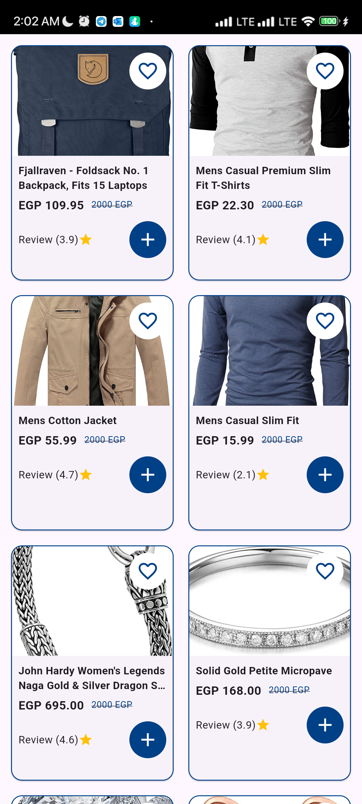

# Project Task Discussion

## Overview

This document provides an overview and discussion of the various components in our project, including `ProductCubit`, `ProductState`, `Product` model, `ProductRepository`, `ProductListScreen`, and `ProductCard`. Each section below outlines the purpose, design, and areas for improvement for each component.
```plaintext
lib/
├── models/
│   └── product.dart                 # Defines the Product model class with properties like id, title, description, price, etc.
├── cubit/
│   ├── product_cubit.dart           # Contains the ProductCubit class to manage product loading and state transitions.
│   └── product_state.dart           # Defines various states for product loading: ProductInitial, ProductLoading, ProductLoaded, and ProductError.
├── repository/
│   └── product_repository.dart      # Implements data fetching logic from an external API using the ProductRepository class.
├── views/
│   └── product_list_screen.dart     # Constructs the ProductListScreen to display a grid of products, handling different states of the product data.
└── widgets/
└── product_card.dart            # Creates the ProductCard widget to display individual product details like image, title, and price.
```
### Screenshot


## ProductCubit

### Task
- Implemented `ProductCubit` to manage the state of product loading and data retrieval.

### Details
- **Class Name:** `ProductCubit`
- **Method:** `loadProducts`
- **State Management:** Handles states for initial, loading, loaded, and error conditions.
- **Error Handling:** Emits a generic error message if product loading fails.


## ProductState

### Task
- Defined states for the product loading process, including `ProductInitial`, `ProductLoading`, `ProductLoaded`, and `ProductError`.

### Details
- **Class Names:** Clear and descriptive.
- **State Definitions:** Each class represents a specific state of the product loading process.


## Product Model

### Task
- Created a `Product` model to represent product data and handle JSON parsing.

### Details
- **Class Name:** `Product`
- **Fields:** Includes properties like `id`, `title`, `description`, `price`, `image`, `rating`, `subtitle`, and `oldPrice`.
- **JSON Parsing:** Handles optional fields and default values.


## ProductRepository

### Task
- Implemented `ProductRepository` to fetch product data from an external API.

### Details
- **Class Name:** `ProductRepository`
- **Method:** `fetchProducts`
- **API Integration:** Uses `Dio` to perform HTTP requests.


## ProductListScreen

### Task
- Built `ProductListScreen` to display a list of products using `BlocBuilder` for state management.

### Details
- **Class Name:** `ProductListScreen`
- **UI Layout:** Uses `GridView.builder` to display products in a grid format.
- **State Handling:** Displays a loading indicator, product list, or error message based on the current state.


## ProductCard

### Task
- Created `ProductCard` widget to display individual product details, including an image, title, price, and rating.

### Details
- **Class Name:** `ProductCard`
- **Design:** Utilizes `Card` with `Stack` for overlay icons and `ClipRRect` for image clipping.
- **Accessibility:** Contains an `IconButton` for actions like adding to favorites.

